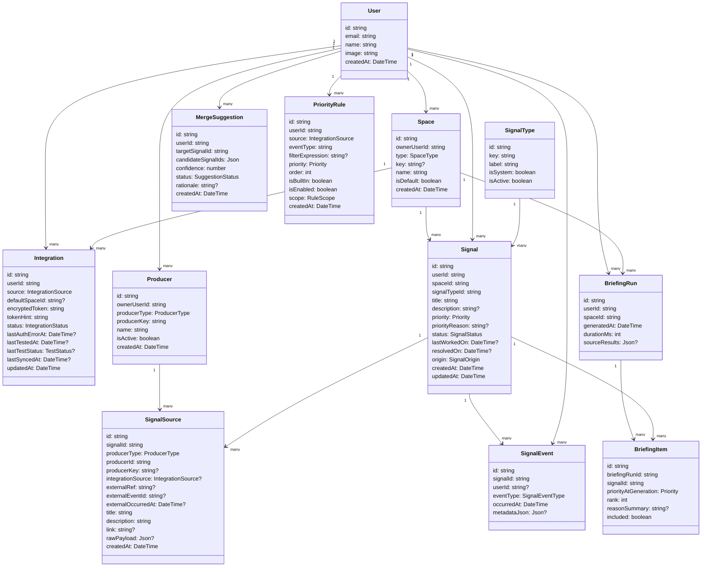
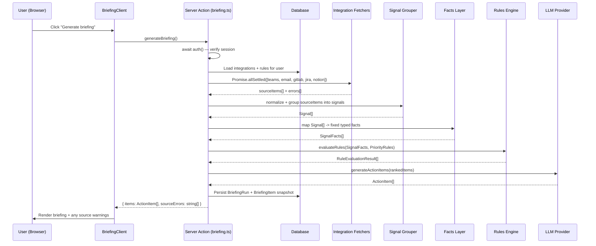

## Problem & Context

Knowledge workers lose significant time each day manually checking Teams, Email, GitLab, Jira, and Notion for signals that require their attention. There is no single place that aggregates and prioritizes these signals. The result is missed context, delayed decisions, and cognitive overhead that crowds out high-impact work.

**Hermes** solves this by giving small teams an on-demand daily briefing: a single, prioritized list of action items pulled from all connected sources, generated on request from the web app. It is a multi-user application with OAuth-based sign-in, per-user credential storage, and user-defined priority rules.

**Key constraints:**

- Built on the existing Next.js 16 / React 19 / Tailwind CSS 4 scaffold
- Next.js 16 enforces fully async APIs — `cookies()`, `headers()`, `params` are all `await`-only
- All LLM calls happen server-side; no provider credentials reach the browser
- Credentials (integration tokens) are stored server-side, encrypted, never sent to the client
- v1 is on-demand only — no background jobs or scheduled delivery

## User Experience

### Flow 1 — Sign In

1. User lands on `/` and sees the Hermes sign-in page
2. Clicks "Sign in with Google" (or Microsoft — one provider configured at deploy time)
3. OAuth redirect → callback → session created → redirected to `/briefing`
4. Unauthenticated users attempting any protected route are redirected to `/`

### Flow 2 — Connect Integrations (Settings)

1. User navigates to `/settings/integrations`
2. Sees a card per integration source (Teams, Email, GitLab, Jira, Notion)
3. Each card shows: connection status (Connected / Not connected), a token input field, a Save button, and a Test Connection button
4. User pastes their personal access token or API key and clicks Save
5. Token is sent to a Server Action, encrypted, and stored server-side against the user's account
6. Card updates to "Connected" with an obfuscated, non-copyable token indicator (token value is never viewable again in UI)
7. User can click Test Connection at any time; server executes an integration-specific **API probe template** to validate token reachability and authorization
8. If test succeeds, show inline success state (last verified)
9. If probe returns `403`, mark integration `UNAUTHORIZED`, emit a `SYSTEM_ALERT` signal, and show inline error on the card

### Flow 3 — Define Priority Rules (Settings)

1. User navigates to `/settings/rules`
2. Sees a list of existing rules (empty state on first visit)
3. Clicks "Add rule" → a form appears with:
  - **Condition**: fact-based conditions (e.g. `isMentioningUser`, `hasFailureState`, `integrationSource`)
  - **Priority intent**: High / Medium / Low (mapped to rule effects)
  - **Enabled toggle**: `isEnabled` (on/off without deleting)
  - **Scope**: `SELF` in v1 (future scopes reserved)
4. User saves the rule; it appears in the list
5. Rules can be reordered (drag or up/down arrows), enabled/disabled, edited inline, or deleted
6. A default set of built-in rules is pre-populated on first sign-in (e.g. "@mention → High", "pipeline failed → High", "assigned to me → High")

### Flow 4 — Generate Briefing (Home)

1. User opens `/briefing` — sees the date, a space switcher, and a "Generate briefing" button; default selected space is `WORK`
2. If no integrations are connected, a prompt guides them to Settings
3. User clicks "Generate briefing":
  - Button enters a loading state with a progress indicator
  - Server Action fires: fetches source items from all connected integrations in parallel
  - Source items are normalized into canonical **Signal Sources** and grouped into **Signals** (each source belongs to exactly one signal)
  - Priority rules are applied and LLM is used for action-item extraction/summarization
  - Hermes persists a first-class briefing snapshot: `BriefingRun` + child `BriefingItem` rows (included and filtered candidates)
4. Briefing renders as a prioritized list grouped into **High / Medium / Low** sections
5. Each signal shows: title/summary, timestamp, source count, space badge, and expandable source/message context
6. User can click "Regenerate" to refresh the briefing
7. If a source fetch fails, that source is skipped and a non-blocking warning banner is shown ("GitLab could not be reached")

### Flow 5 — Review Merge Suggestions (Human-in-the-loop)

1. User opens `/signals/review` and sees a dedicated **Review Suggestions** panel
2. Hermes lists LLM-suggested merges (e.g., Jira + Teams + GitLab references that appear to represent one work thread)
3. For each suggestion, user can inspect candidate signals and combined context previews
4. User clicks **Approve** or **Reject** per suggestion
5. On Approve: selected source memberships are moved into the target signal; related messages are appended into combined context
6. On Reject: no data mutation occurs
7. Human decision is final; LLM never auto-merges in v1

### Flow 6 — Manual Signal Source Entry

1. User can add a manual source to a signal
2. Manual source requires: `title`, `description`; `link` is optional
3. Manual source behaves like any other source in rendering and merge review
4. Manual source must belong to exactly one signal

### Flow 7 — Signal Lifecycle Actions

1. User can click **Mark worked today** on a signal to set `lastWorkedOn` to today (manual only in v1)
2. User can click **Resolve** on a signal to set `resolvedOn` and remove it from default active views
3. Resolved signals are excluded by default from briefing/signal list, but still searchable via filters
4. User can reopen a resolved signal; reopening clears `resolvedOn`
5. Signals not worked on recently surface a **stale badge/filter** only; no automatic priority/ranking impact in v1
6. Every lifecycle mutation writes a `SignalEvent` record in the same DB transaction

### Flow 8 — Space Selection & Filtering

1. Briefing defaults to `WORK` space on page load
2. User can switch active space to `PERSONAL` or `PROJECT`
3. Integration/manual signal creation assigns space via configured mapping defaults
4. Future public API ingestion requires caller-provided `spaceKey` on each request
5. Rules remain space-agnostic in v1; space only affects filtering/view selection
6. Selected space filters visible signals and briefing items for that run

### Information Hierarchy

- **Critical**: High-priority signals (mentions, assignments, failures)
- **Secondary**: Medium-priority signals (status changes, comments on watched items)
- **Tertiary**: Low-priority signals (general activity, FYI updates)
- Each signal exposes source count and expandable per-source context
- Signals can show a **stale** indicator based on `lastWorkedOn`
- Source errors are surfaced but never block the briefing from rendering

### Edge Cases

- No connected integrations → empty state with CTA to Settings
- All sources return no signals → "Nothing needs your attention today" state
- Any integration returns `403` during fetch or explicit test probe → mark that integration `UNAUTHORIZED` and surface a user-facing notification as a **system Signal**
- Manual Test Connection probe fails with non-403 errors (timeout/network/5xx) → keep status unchanged, show inline "test failed" message
- All connected sources fail in a run → dedicated "Unable to generate briefing right now" error state (distinct from "no signals today")
- LLM call fails or returns invalid schema → **fail-closed** behavior (show error state, no briefing results)
- Partial non-auth source failure → briefing can render with available source results + per-source notice
- Merge suggestion references already-moved sources → suggestion becomes stale and is auto-invalidated in review panel
- Merge cannot leave a signal with zero sources; empty signals are automatically removed
- Split is explicitly out of scope for v1
- Resolved signals are filtered out by default but available through search/filter
- Reopening a resolved signal clears `resolvedOn`
- If Signal mutation succeeds but event write cannot be persisted, the entire transaction is rolled back and user sees a retryable inline error
- If a selected space has no active signals, show an empty state for that space (distinct from global no-signal state)
- If a briefing run contains only filtered candidates (`included=false`), show empty actionable state while preserving historical run snapshot
- Session expires mid-briefing → redirect to sign-in, briefing state is lost (acceptable for v1)

## Technical Approach

### Architectural Approach

**App Router + Server Components as the primary rendering model.** The briefing page is a Server Component that triggers a Server Action on demand. No client-side data fetching for the core briefing flow — the server fetches, processes, and returns structured data in one round-trip.

**Key architectural decisions:**


| Decision                  | Choice                                                                         | Rationale                                                                                                             |
| ------------------------- | ------------------------------------------------------------------------------ | --------------------------------------------------------------------------------------------------------------------- |
| Auth                      | NextAuth.js v5 (Auth.js)                                                       | Native Next.js 16 App Router support; session available via `auth()` in Server Components and Actions                 |
| Token storage             | Database (encrypted at rest) with obfuscated UI display                        | Tokens must survive server restarts; token values are never re-shown or copyable in UI                                |
| Encryption key strategy   | Single active server-side key in v1 (`ENCRYPTION_KEY`)                         | Keeps implementation simple for local NUC deployment; key rotation/versioning deferred intentionally                  |
| Database                  | SQLite via Prisma (dev) / PostgreSQL-compatible (prod)                         | Minimal ops overhead for a small team; Prisma provides type-safe schema                                               |
| Signal ownership model    | Exactly one signal per source                                                  | Prevents duplication and conflict; merge moves source membership rather than copying                                  |
| Merge workflow            | LLM suggestions + explicit human approve/reject                                | Keeps UX simple while maintaining human final control                                                                 |
| Split workflow            | Out of scope for v1                                                            | Avoids complexity; manual source/signal creation is the fallback                                                      |
| Signal lifecycle fields   | `lastWorkedOn` + `resolvedOn` on Signal                                        | Supports manual activity tracking, stale filtering, and resolved-by-default-hidden behavior                           |
| Signal history model      | Lightweight persisted `SignalEvent` table                                      | Captures what happened/when for future calendar/history/reporting use cases                                           |
| Briefing history model    | `BriefingRun` + child `BriefingItem` table                                     | Enables replay/diff/trend queries for what was shown/filtered on each run                                             |
| Space/domain model        | First-class `Space` entity with `SpaceType` + optional `spaceKey`              | Cleanly separates WORK/PERSONAL/PROJECT concerns and prepares future ingestion API design                             |
| Producer model            | First-class `Producer` entity + `SignalSource.producerId`                      | Supports cross-app ingestion provenance and producer-level controls                                                   |
| Space assignment          | Inferred for integration/manual sources; API producers must provide `spaceKey` | Deterministic assignment across internal and external producers                                                       |
| Rules engine boundary     | Strict dedicated module at `lib/rules-engine/*` with one public interface      | Prevents rule logic from creeping into app-specific modules; makes future extraction/replacement straightforward      |
| Rules input model         | Normalized fixed typed facts layer before evaluation                           | Rules operate on provider-agnostic facts, not raw integration payload strings                                         |
| Rules output model        | Generic effect result shape (first-match runtime in v1)                        | Future reusable engine path while keeping Hermes runtime simple now                                                   |
| Signal type extensibility | `SignalType` seeded lookup table (system-managed in v1)                        | Extend signal types without code changes and without enum churn                                                       |
| LLM abstraction           | Provider interface + concrete adapters with hybrid contract                    | Provider-swappable while enforcing strict core fields (`priority/title/link`) and allowing optional free-text summary |
| Integration token testing | Backend-defined per-integration API probe templates (no shell execution)       | Safe, deterministic token validation without user-configured commands or command-execution risk                       |
| Integration fetching      | Parallel `Promise.allSettled` with explicit auth handling                      | Preserve partial success; mark integration unauthorized on `403`; no retries for `4xx` auth failures                  |
| Briefing generation       | Single Server Action invoked by a Client Component button                      | `useActionState` provides pending/error state; if LLM fails schema/response, fail-closed error state                  |
| Ownership enforcement     | All user-scoped reads/writes constrained by authenticated user ownership        | Prevents cross-user access now and preserves a clean path if Hermes ever supports multiple users                       |
| Styling                   | Tailwind CSS 4 (already configured)                                            | No additional setup needed                                                                                            |
| UI component library      | shadcn/ui behind owned core components                                         | Feature code never depends directly on raw shadcn primitives                                                          |


**Next.js 16 constraints respected:**

- All `cookies()`, `headers()`, `params` calls are `await`-ed
- `auth()` from NextAuth.js v5 is async — called with `await auth()` in every Server Action and Route Handler
- `proxy.ts` used only for lightweight session presence check (redirect unauthenticated users); no heavy logic at the proxy boundary

### Data Model



**Enums:**

- `IntegrationSource`: `TEAMS | EMAIL | GITLAB | JIRA | NOTION`
- `Priority`: `HIGH | MEDIUM | LOW`
- `IntegrationStatus`: `CONNECTED | UNAUTHORIZED | DISCONNECTED`
- `TestStatus`: `PASS | FAIL`
- `SignalStatus`: `ACTIVE | RESOLVED`
- `SignalOrigin`: `INTEGRATION | MANUAL | SYSTEM | API`
- `ProducerType`: `INTEGRATION | MANUAL | SYSTEM | API`
- `SuggestionStatus`: `OPEN | APPROVED | REJECTED | STALE`
- `SignalEventType`: `CREATED | UPDATED | STATUS_CHANGED | MERGED_IN | MARKED_WORKED | RESOLVED | REOPENED | PRIORITY_CHANGED | SOURCE_ADDED | SYSTEM_ALERT_CREATED`
- `RuleScope`: `SELF` (v1), future values reserved
- `SpaceType`: `WORK | PERSONAL | PROJECT`

**Signal definition (canonical):**

A **Signal** is the primary unit shown in the UI. A signal is composed of one or more **Signal Sources** and belongs to exactly one **Space**. It has exactly these invariants in v1:

- every signal has **at least one source**
- every source belongs to **exactly one signal**
- every signal belongs to **exactly one space**
- a source can originate from integration, manual, system, or API producers

**Merge behavior (v1):**

- LLM proposes merge suggestions, but never auto-applies them
- user decision in Review Suggestions panel is final (`Approve` / `Reject`)
- on approve, source memberships and related messages are moved/combined into the target signal
- target signal fields (`title`, `priority`, etc.) remain unchanged in v1
- split is out of scope for v1

**Lifecycle behavior (v1):**

- `lastWorkedOn` is updated manually only via explicit user action
- `resolvedOn` is set when user marks a signal complete
- resolved signals are excluded from default views and included when searching/filtering for resolved
- reopening a signal clears `resolvedOn`
- stale handling is display/filter only (no automatic priority/ranking changes in v1)

**Signal event logging (v1):**

- Hermes persists lightweight event history in `SignalEvent`
- lifecycle and merge-relevant actions emit typed events with `occurredAt` and optional `metadataJson`
- Signal state mutation + `SignalEvent` insert are atomic in one DB transaction
- `userId` is nullable to support system-originated events

**Notes:**

- `encryptedToken` is AES-256-GCM encrypted using a server-side `ENCRYPTION_KEY` env var; `tokenHint` stores the last 4 characters for display
- v1 uses a **single active encryption key** (no rotation/versioning) as an explicit simplicity trade-off for local NUC deployment
- token values are never returned in API responses and never re-displayed in copyable form after save
- any provider `403` (during periodic fetch or explicit test probe) transitions `Integration.status` to `UNAUTHORIZED` and emits a `SYSTEM_ALERT` signal for user notification
- Test Connection uses backend-defined probe templates per integration type; users cannot edit probe definitions in UI
- probe execution is API-only (no shell/CLI command execution)
- manual source requires `title` and `description`; `link` is optional
- v1 includes lightweight persisted signal history via `SignalEvent` (not a full compliance-grade audit system)
- stale status is determined from `lastWorkedOn` and shown as badge/filter only (no ranking effect in v1)
- `BriefingItem` is the authoritative historical record of what was considered/shown per run
- `BriefingRun.spaceId` records the space context for the run — critical for historical replay, trend analysis, and correct filtering of past runs
- `sourceResults` on `BriefingRun` is optional diagnostic payload and not the primary history source
- `SignalType` is a seeded system-managed lookup in v1 (not user-editable)
- `Space` is a first-class entity; `spaceKey` is optional and unique only when present
- `Producer` is a first-class entity for provenance and future public-ingestion controls
- signal space assignment is inferred for integration/manual sources (including `Integration.defaultSpaceId` when configured)
- future API-produced signals must include `spaceKey` on each ingest request
- idempotency for future API ingest is keyed by `(producerKey, externalEventId)` uniqueness
- uniqueness guardrail: Integration `(userId, source)` is unique
- uniqueness guardrail: SignalSource `(producerId, externalRef)` is unique when `externalRef` is present
- deduplication behavior: if a `SignalSource` with matching `(producerId, externalRef)` already exists, update/attach it to the existing signal — do not create a new signal
- integration adapters are responsible for generating stable `externalRef` values per source; for sources without native stable IDs, adapters must derive a deterministic composite key (e.g., `${channelId}:${messageTimestamp}` for Teams)
- `SignalSource.producerId` is required (not nullable); every persisted SignalSource must have a resolved producer, ensuring the uniqueness guardrail is never bypassed
- `SignalSource.externalOccurredAt` stores the source-reported event timestamp; used for deterministic ordering and LLM source selection; falls back to `createdAt` when not provided by source
- `Integration.lastSyncedAt` is updated on each successful fetch run to track processing recency
- `Signal.priorityReason` stores a human-readable explanation of why a signal received its current priority (populated when a rule fires or priority changes)
- briefing view defaults to `WORK`, with user switch to `PERSONAL`/`PROJECT`
- `PriorityRule.scope` is persisted with `SELF` as the only allowed v1 value
- `isEnabled` allows disabling a rule without deleting it
- `PriorityRule.source` is a convenience filter for authoring and storage in v1; runtime evaluation still operates on normalized facts only — this keeps the future engine extraction path clean
- `PriorityRule.filterExpression` is evaluated against normalized facts (not raw provider payload strings)
- `isBuiltIn` flags the default rules seeded on first sign-in so they can be distinguished from user-created ones
- ownership invariant: all persisted user-scoped relationships must be ownership-consistent (`Signal.userId` must match `Space.ownerUserId`; `Integration.userId`, `Producer.ownerUserId`, `PriorityRule.userId`, `MergeSuggestion.userId`, and `BriefingRun.userId` must all belong to the same authenticated user for related operations)
- authorization rule: every read and mutation must constrain by `auth().user.id` and verify ownership of every referenced entity before acting; passing a valid record id is never sufficient on its own

### Component Architecture

#### Route Structure

```
app/
├── (auth)/
│   └── page.tsx                  # Sign-in page (public)
├── (app)/
│   ├── layout.tsx                # Authenticated shell layout (nav, user menu)
│   ├── briefing/
│   │   ├── page.tsx              # Briefing home (Server Component)
│   │   └── loading.tsx           # Skeleton while briefing generates
│   ├── signals/
│   │   ├── page.tsx              # Signal list/detail view
│   │   └── review/
│   │       └── page.tsx          # Review Suggestions panel (approve/reject)
│   └── settings/
│       ├── layout.tsx            # Settings tab layout
│       ├── integrations/
│       │   └── page.tsx          # Integration token management
│       └── rules/
│           └── page.tsx          # Priority rule editor
├── api/
│   └── auth/
│       └── [...nextauth]/
│           └── route.ts          # NextAuth.js callback handler
lib/
├── auth.ts                       # NextAuth.js config (provider, session strategy)
├── db.ts                         # Prisma client singleton
├── crypto.ts                     # Token encrypt/decrypt utilities
├── llm/
│   ├── interface.ts              # LlmProvider interface
│   ├── openai.ts                 # OpenAI adapter
│   ├── anthropic.ts              # Anthropic adapter
│   └── index.ts                  # Factory: reads LLM_PROVIDER env var
├── integrations/
│   ├── interface.ts              # IntegrationFetcher interface
│   ├── definitions.ts            # Backend probe templates per integration type
│   ├── teams.ts
│   ├── email.ts
│   ├── gitlab.ts
│   ├── jira.ts
│   └── notion.ts
├── producers/
│   ├── registry.ts               # Producer lookup, activation state, and key resolution
│   └── idempotency.ts            # `(producerKey, externalEventId)` duplicate protection utilities
├── signals/
│   ├── normalize-sources.ts      # Converts integration/manual inputs into canonical SignalSource
│   ├── group-signals.ts          # Builds/updates signals (one-source-one-signal invariant)
│   ├── suggest-merges.ts         # LLM-assisted merge suggestion generation
│   └── apply-merge.ts            # Applies approved merge by moving source memberships
├── rules-engine/
│   ├── interface.ts              # Public engine contract (single entrypoint)
│   ├── facts.ts                  # Signal -> fixed typed facts normalization
│   ├── evaluator.ts              # First-match rule evaluation runtime (v1)
│   ├── effects.ts                # Generic effect shape + conflict resolution rules
│   └── adapters/
│       └── hermes.ts             # Hermes-specific mapping of effects -> app behavior
├── briefing/
│   ├── fetch-signals.ts          # Orchestrates parallel fetching via Promise.allSettled
│   ├── generate-briefing.ts      # Calls LLM provider to produce action items
│   └── persist-run-snapshot.ts   # Persists BriefingRun + BriefingItem rows atomically
actions/
├── integrations.ts               # Server Actions: save/delete/test integration tokens
├── rules.ts                      # Server Actions: create/update/delete/reorder/enable-disable rules
├── signals.ts                    # Server Actions: create manual source, approve/reject merge suggestion, update lifecycle fields
└── briefing.ts                   # Server Action: generate briefing (main pipeline + snapshot persistence)
```

#### Key Component Responsibilities


| Component / Module                     | Responsibility                                                                                                                                                                                                                                                                                 |
| -------------------------------------- | ---------------------------------------------------------------------------------------------------------------------------------------------------------------------------------------------------------------------------------------------------------------------------------------------- |
| `(auth)/page.tsx`                      | Renders sign-in button; redirects authenticated users to `/briefing`                                                                                                                                                                                                                           |
| `(app)/layout.tsx`                     | Verifies session via `await auth()`; renders nav shell; redirects if unauthenticated                                                                                                                                                                                                           |
| `briefing/page.tsx`                    | Server Component; loads user's signal-level briefing data; renders `BriefingClient`                                                                                                                                                                                                            |
| `BriefingClient`                       | `'use client'`; holds the "Generate" button; calls `generateBriefing` Server Action via `useActionState`; renders `BriefingList`                                                                                                                                                               |
| `BriefingList`                         | Renders High/Medium/Low signal sections with source counts, stale indicators, space badges, and expandable context                                                                                                                                                                             |
| `SignalCard`                           | `'use client'`; supports Mark worked today, Resolve, and Reopen actions                                                                                                                                                                                                                        |
| `SpaceSwitcher`                        | `'use client'`; defaults to `WORK` and filters briefing view to selected space                                                                                                                                                                                                                 |
| `signals/review/page.tsx`              | Server Component; renders Review Suggestions panel for merge approve/reject                                                                                                                                                                                                                    |
| `SignalSuggestionCard`                 | `'use client'`; displays candidate merge context and Approve/Reject actions                                                                                                                                                                                                                    |
| `settings/integrations/page.tsx`       | Server Component; loads existing integrations and test metadata; renders `IntegrationCard` per source                                                                                                                                                                                          |
| `IntegrationCard`                      | `'use client'`; token input, save/delete/test via Server Actions, inline status + inline test result                                                                                                                                                                                           |
| `settings/rules/page.tsx`              | Server Component; loads rules; renders `RuleList`                                                                                                                                                                                                                                              |
| `RuleList`                             | `'use client'`; add/edit/delete/reorder/enable-disable rules via Server Actions                                                                                                                                                                                                                |
| `lib/signals/group-signals.ts`         | Maintains one-source-one-signal invariants and grouped message context                                                                                                                                                                                                                         |
| `lib/signals/space-assignment.ts`      | Resolves target space from source/integration mapping rules                                                                                                                                                                                                                                    |
| `lib/signals/suggest-merges.ts`        | Produces LLM-assisted merge suggestions as non-binding recommendations                                                                                                                                                                                                                         |
| `lib/producers/registry.ts`            | Manages producer identity (`producerType`, `producerKey`) for internal and future API sources                                                                                                                                                                                                  |
| `lib/producers/idempotency.ts`         | Enforces `(producerKey, externalEventId)` idempotency for ingest pipelines                                                                                                                                                                                                                     |
| `lib/signals/events.ts`                | Creates typed `SignalEvent` entries with normalized metadata payloads                                                                                                                                                                                                                          |
| `actions/signals.ts`                   | Handles manual source creation, merge suggestion approve/reject, and lifecycle updates (`lastWorkedOn`, resolve/reopen) with atomic event writes                                                                                                                                               |
| `lib/rules-engine/interface.ts`        | Single public API for rule evaluation (strict boundary; no rule logic outside module)                                                                                                                                                                                                          |
| `lib/rules-engine/facts.ts`            | Normalizes signals into fixed typed facts for provider-agnostic evaluation                                                                                                                                                                                                                     |
| `lib/rules-engine/evaluator.ts`        | Executes first-match rules in order and returns generic effects                                                                                                                                                                                                                                |
| `lib/rules-engine/effects.ts`          | Resolves effect conflicts (`priorityOverride` wins over `priorityDelta`)                                                                                                                                                                                                                       |
| `lib/briefing/persist-run-snapshot.ts` | Persists `BriefingRun` and ordered `BriefingItem` rows for historical replay/analytics                                                                                                                                                                                                         |
| `lib/llm/interface.ts`                 | `LlmProvider` interface with hybrid output contract: strict `priority/title/link`, optional summary                                                                                                                                                                                            |
| `lib/integrations/interface.ts`        | `IntegrationFetcher` interface producing canonical `SignalSource[]`; auth failures (`403`) mapped to unauthorized state transitions                                                                                                                                                            |
| `lib/integrations/definitions.ts`      | Declares backend-managed, per-integration API probe templates used by Test Connection                                                                                                                                                                                                          |
| `actions/briefing.ts`                  | Server Action: `await auth()` → decrypt tokens → `Promise.allSettled(fetchers)` → normalize/group into signals → map facts + evaluate rules via `lib/rules-engine` → `llm.generateActionItems` (schema-validated) → persist run snapshot (`BriefingRun` + `BriefingItem`) → return/fail-closed |


#### Briefing Generation Flow



#### LLM Provider Abstraction

The `LlmProvider` interface is the single seam for swapping providers:

```ts
interface LlmProvider {
  generateActionItems(
    signals: RankedSignal[],
    context: BriefingContext
  ): Promise<ActionItem[]>
}
```

A factory in `lib/llm/index.ts` reads `LLM_PROVIDER` and `LLM_API_KEY` from environment variables and returns the appropriate concrete adapter. Adding a new provider requires only a new adapter file — no changes to the briefing pipeline.

Hybrid contract policy for v1:

- Core fields are schema-validated and required: `priority`, `title`, `link`
- Optional field: `summary`
- If provider response fails schema validation or request fails, Hermes uses **fail-closed** behavior and returns a dedicated error state (no briefing results)

Integration fetcher failure policy for v1:

- Parallel fan-out via `Promise.allSettled`
- No retries for `4xx` auth errors
- `403` marks the specific integration as `UNAUTHORIZED` and triggers user notification via `SYSTEM_ALERT` signal
- If all connected sources fail in a run, render dedicated "unable to generate briefing" state (not "no signals")

Integration Test Connection policy for v1:

- Test button triggers a server-side API probe for the selected integration
- Probe definitions are backend-managed templates per integration type
- No shell/CLI command execution in Hermes runtime
- Probe `403` updates integration to `UNAUTHORIZED`, emits `SYSTEM_ALERT`, and returns inline card error
- Probe non-403 failure returns inline test failure while preserving current integration status

Signal merge policy for v1:

- Signals can contain multiple sources; each source belongs to exactly one signal
- Merge suggestions are LLM-assisted recommendations only (never auto-applied)
- Review happens in a dedicated Review Suggestions panel with per-item Approve/Reject
- Approve merges source memberships and related messages into target signal
- Target signal fields remain unchanged after merge in v1
- Split is out of scope in v1; manual source/signal creation is the fallback
- v1 relies on lightweight persisted `SignalEvent` history instead of a full compliance-grade audit subsystem
- At merge apply time, `apply-merge.ts` must revalidate all source→signal relationships before committing; if any source has already been moved, the operation is rejected as stale and the caller receives a conflict error (not a silent partial merge)

Signal lifecycle policy for v1:

- `lastWorkedOn` is user-managed only via explicit "Mark worked today"
- `resolvedOn` marks completion date and defaults signal out of active views
- resolved signals remain searchable/filterable on demand
- reopening clears `resolvedOn`
- stale uses badge/filter only and does not alter ranking in v1

Signal mutation concurrency policy for v1:

- Signal and SignalSource invariants ("every signal has at least one source", "each source belongs to exactly one signal") are enforced by DB constraints as the primary safety net
- Concurrent mutations that conflict with constraints (e.g., duplicate ingestion race, merge + lifecycle update collision) are caught by the DB and bubbled up as conflict errors at the application layer
- v1 concurrency strategy: rely on DB constraints + caller retry on conflict (no optimistic locking or distributed locks in v1)
- This is an explicit accepted trade-off for a single-NUC deployment where true concurrency is low

Ownership and authorization policy for v1:

- All user-scoped queries and mutations must be constrained by the authenticated user id from `await auth()`
- Server Actions and Route Handlers must verify ownership of every referenced `Signal`, `Space`, `Integration`, `Producer`, `MergeSuggestion`, `PriorityRule`, and `BriefingRun` before reading or mutating
- Cross-entity ownership must remain consistent for all persisted relationships; mismatched ownership is treated as an application error and the write must be rejected
- v1 assumes low user count, but ownership checks are mandatory from the first implementation so future multi-user support does not require a security rewrite

Rules engine policy for v1:

- Rule logic is isolated under `lib/rules-engine/*` with one public evaluation interface
- No business module outside `lib/rules-engine/*` can implement or duplicate rule evaluation logic
- A fixed typed facts layer is mandatory before evaluation (provider payloads are normalized first)
- Explicit contract: `Signal -> deriveFacts(signal) -> evaluateRules(facts)`
- Signals must be deterministically ordered before rule evaluation and LLM generation — v1 ordering is by `max(SignalSource.externalOccurredAt ?? SignalSource.createdAt)` per signal, descending
- Initial fixed facts include: `isAssignedToUser`, `isMentioningUser`, `hasFailureState`, `isUnread`, `hasExternalLink`, `integrationSource`, `signalType`, `spaceType`, `producerType`, `producerKey`, `ageHours`, `sourceCount`
- Space/producer facts are part of `SignalFacts`, but are intentionally not exposed as v1 rule conditions (rules remain space/producer-agnostic in v1)
- Runtime evaluation is **strict first-match**: rules are evaluated in order, the first matching rule returns its effects and evaluation stops immediately — no further rules fire
- Evaluation result uses a generic effects shape:
  - `priorityDelta?: number` (carried for forward compatibility; has no effect in v1 strict first-match unless no `priorityOverride` is present)
  - `priorityOverride?: HIGH | MEDIUM | LOW`
  - `tags?: string[]`
  - `include?: boolean`
  - `reasons?: string[]`
- Conflict policy: if both `priorityOverride` and `priorityDelta` are present in the same effect, `priorityOverride` wins and delta is ignored
- Hermes v1 consumes a subset of effects (`priority`, include/exclude, reasons) while preserving future portability

SignalEvent policy for v1:

- Persist `SignalEvent` rows for key signal events: `CREATED`, `UPDATED`, `STATUS_CHANGED`, `MERGED_IN`, `MARKED_WORKED`, `RESOLVED`, `REOPENED`, `PRIORITY_CHANGED`, `SOURCE_ADDED`, `SYSTEM_ALERT_CREATED`
- `metadataJson` stores compact event context (e.g., source ids moved, previous/new priority, suggestion id)
- Signal state mutation and event insert occur in one transaction
- No legacy import/backfill required because this is a new project

LLM input bounding policy for v1:

- LLM input must be bounded before each generation call to prevent context explosion, cost spikes, and model failures
- v1 bounding strategy: max 5 sources per signal sent to LLM; each source payload truncated to 500 characters
- Signals with more sources than the limit use the N most recently active sources
- Bounding is applied in `generate-briefing.ts` before the LLM call; bounded context is not persisted

Briefing snapshot policy for v1:

- Persist `BriefingRun` for each generation request, including the active `spaceId` at generation time
- Persist child `BriefingItem` rows for considered signals
- `included=false` means signal was considered during generation but filtered out (e.g., resolved/hidden rules)
- `rank` is global across included briefing output (`1..N`)
- `reasonSummary` stores LLM-generated reason snapshot at generation time

## Testing Strategy

### Tools

- **Vitest** — primary test runner for all logic, unit, and module-level tests
- **Playwright** — browser automation for a small, high-value end-to-end smoke suite

### Testing Pyramid

- 70% logic/unit tests (Vitest)
- 20% module/service/integration tests (Vitest + test DB)
- 10% end-to-end tests (Playwright)

Hermes has a lot of deterministic business logic. The vast majority of test value comes from fast, focused logic tests.

### Test Scope Principle

Test at the **module boundary**, not the file boundary.

- Do not think: "test `evaluator.ts`"
- Think: "test rule evaluation behavior"
- Do not think: "test `apply-merge.ts`"
- Think: "test merge application invariants"

This keeps tests resilient to internal refactors.

---

### Tier 1 — Vitest Logic Tests (must-have)

These protect your architecture.

**Rules engine**

- First matching rule wins; evaluation stops after first match
- Disabled rules (`isEnabled: false`) do not fire
- No matching rule returns no effects
- `priorityOverride` beats `priorityDelta` when both present

**Facts derivation**

- Signal maps to expected `SignalFacts`
- Missing optional source fields do not crash
- `ageHours` and `sourceCount` are computed correctly

**Signal grouping / deduplication**

- Repeated source with same `(producerId, externalRef)` does not create a new signal
- Different sources create separate signals
- Merge preserves all signal invariants
- Empty signals are removed after source movement

**Merge application**

- Stale suggestions are rejected server-side before commit
- Source membership is revalidated before merge applies
- Signal never ends with zero sources
- `SignalEvent` is written atomically with state mutation

**Space assignment**

- Integration default space is applied correctly
- Manual source assignment is correct
- Missing/invalid space fails clearly and explicitly

**Integration adapter contract tests**

- Raw provider payload → canonical `SignalSource`
- Missing fields handled gracefully
- Malformed payloads produce structured errors
- Auth failure maps to `UNAUTHORIZED` state
- `externalRef` generation is stable and deterministic
- `externalOccurredAt` is correctly extracted from provider timestamp fields

**LLM output validation**

- Valid provider response maps to correct `ActionItem` shape
- Schema validation catches missing required fields (`priority`, `title`, `link`)
- Schema failure triggers fail-closed behavior

---

### Tier 2 — Playwright E2E Tests (critical paths only)

Keep this small. Cover what users will actually notice if broken.

- **Happy path**: sign in → add integration → generate briefing → see grouped results
- **Rules path**: create rule → generate briefing → see changed prioritization
- **Lifecycle path**: mark worked today → resolve → reopen
- **Merge path**: review suggestion → approve → verify changed signal structure
- **Failure path**: one integration fails → briefing renders with warning banner
- **Auth**: sign in → redirect behavior
- **Space switcher**: switch space → different signal set shown

---

### Mocking Strategy

**Always mock in logic tests:**

- External APIs and provider HTTP calls
- LLM provider responses
- Auth/session in pure unit tests
- Encryption helpers in non-auth tests
- Time (for age/ordering/staleness tests)

**Never mock in behavioral tests:**

- Rules engine
- Signal grouping logic
- Deduplication logic
- Merge validation logic

---

### Database Strategy

**Vitest tests:**

- Use a dedicated test database (SQLite compatible with Prisma)
- Per-test or per-suite setup/teardown for DB-heavy tests
- Use factory helpers for readable, repeatable setup

**Playwright tests:**

- Separate seeded test database
- Deterministic fixtures; no dependency on live third-party integrations

---

### Factory Helpers

All tests should use factory helpers rather than inline object construction:

```
tests/fixtures/builders/
├── makeSignal()
├── makeSignalSource()
├── makeRule()
├── makeIntegration()
└── makeMergeSuggestion()
```

This is especially important for agent-generated tests — it keeps test code readable and avoids repetitive, fragile setup.

---

### Test Directory Structure

```
tests/
├── unit/
│   ├── rules-engine/
│   ├── signals/
│   ├── integrations/
│   └── briefing/
├── integration/
│   ├── db/
│   └── actions/
├── e2e/
│   ├── auth.spec.ts
│   ├── briefing.spec.ts
│   ├── rules.spec.ts
│   ├── lifecycle.spec.ts
│   └── merge-review.spec.ts
└── fixtures/
    ├── builders/
    ├── payloads/
    └── seeds/
```

---

### Testing Standards for Agents

- Every new business-rule module must have Vitest coverage before shipping
- Every bug fix must add a regression test
- Complex logic must be tested before UI polish is added
- Playwright tests must cover user-critical paths only — not edge cases
- Mocks must not replace the logic being validated

### Explicitly Deferred

- Visual regression testing
- Snapshot-heavy component testing
- Contract testing against live third-party APIs
- Full browser coverage for every edge case
- Separate API test framework

## Coding Standards

The following standards apply to all implementation work in this codebase. Agents and contributors must follow these throughout.

### Naming & Intent

- Functions must express intent clearly — use descriptive names that reflect what the function does, not how it does it (e.g. `deriveSignalFacts`, not `processData`)
- Keep functions small and single-purpose; prefer composing multiple small functions over large multi-step functions

### Purity & Side-Effect Control

- Core logic must be pure where possible — functions in the main pipeline (`facts`, `rules`, `briefing`) must not mutate inputs or rely on hidden state
- No side effects inside evaluation logic — do not mutate models (e.g. `Signal`) inside rules or processing; always return results

### Architectural Boundaries

- Respect the layer order strictly: `integrations` → `signals` → `facts` → `rules` → `briefing`
- No layer may depend on lower-level raw data (e.g. rules must not read API payloads; they operate only on `SignalFacts`)
- All external system calls must go through adapters — no direct API calls outside `lib/integrations/` or `lib/llm/`

### Type Safety

- Use explicit types at all boundaries — define clear types for inputs/outputs (e.g. `SignalFacts`, `RuleEffect`)
- Avoid `any` and implicit shapes; all inter-layer contracts must be fully typed

### Documentation

- Add comments explaining **why**, not what — only document non-obvious logic or decisions (e.g. `// Prioritise assigned MRs because they block delivery`)
- Do not add comments that restate what the code already clearly expresses

### Error Handling

- Fail explicitly, never silently — handle errors clearly and return structured results
- No swallowed errors or undefined states — every failure path must produce a typed result or throw explicitly

### UI Component Standards

**Foundation:** shadcn/ui provides the raw primitives. Feature code must never import shadcn components directly.

**Key principle:** Raw shadcn components are always wrapped in owned core components before being used in feature or page code. This insulates the application from upstream changes and keeps design decisions centralized.

**Layer structure:**

```
components/
├── ui/                    # Raw shadcn/ui components (auto-generated, do not hand-edit)
│   ├── button.tsx
│   ├── dialog.tsx
│   └── input.tsx
├── core/                  # Owned wrappers and design-system components
│   ├── AppButton.tsx
│   ├── PageLayout.tsx
│   ├── SignalCard.tsx
│   └── PriorityBadge.tsx
└── features/              # Feature-scoped UI built from core components only
    ├── briefing/
    │   ├── BriefingList.tsx
    │   ├── SignalItem.tsx
    │   └── FiltersBar.tsx
    └── settings/
        └── ...
```

**Rules:**

- `features/` components may only import from `core/` — never from `ui/` directly
- `core/` components wrap `ui/` components and expose domain-aware APIs
- `ui/` directory is managed by shadcn CLI; do not hand-edit generated files
- Styling and variant decisions live in `core/` components, not in feature code